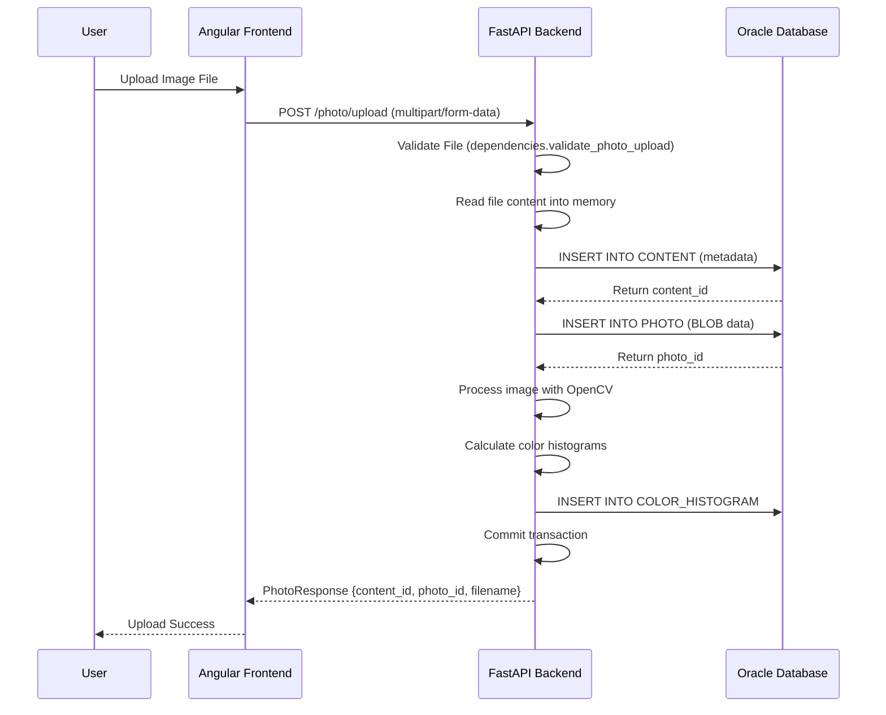
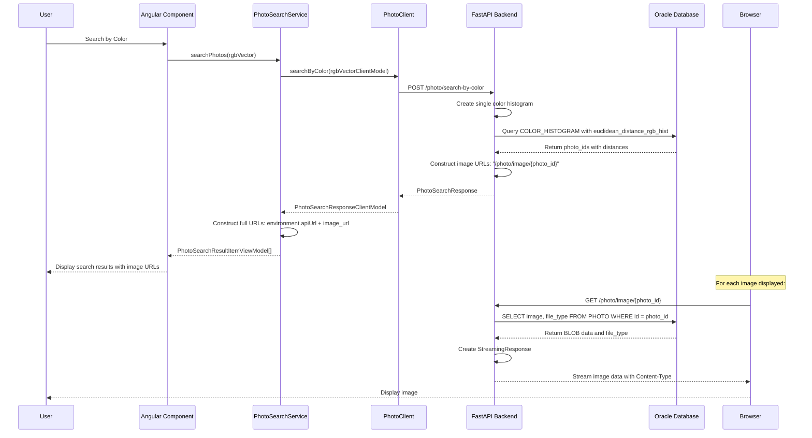
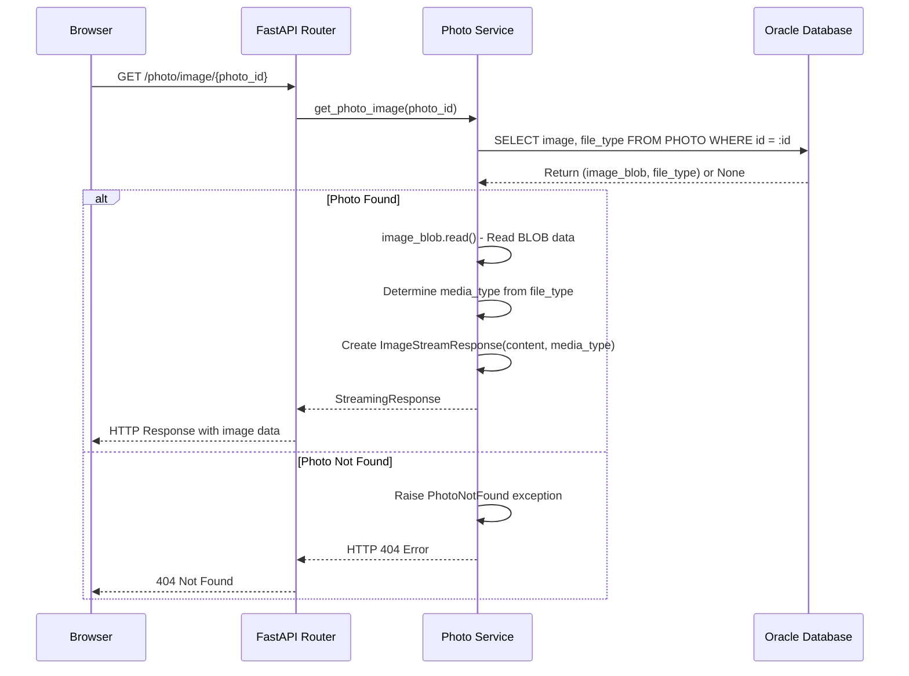
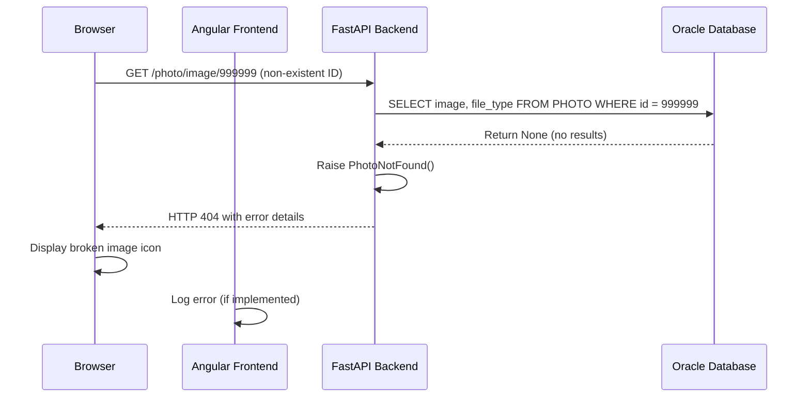
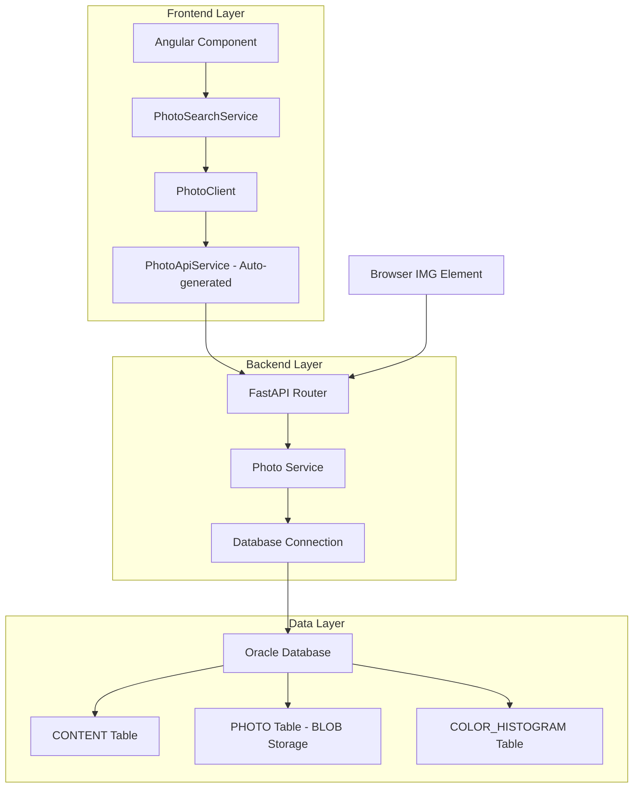
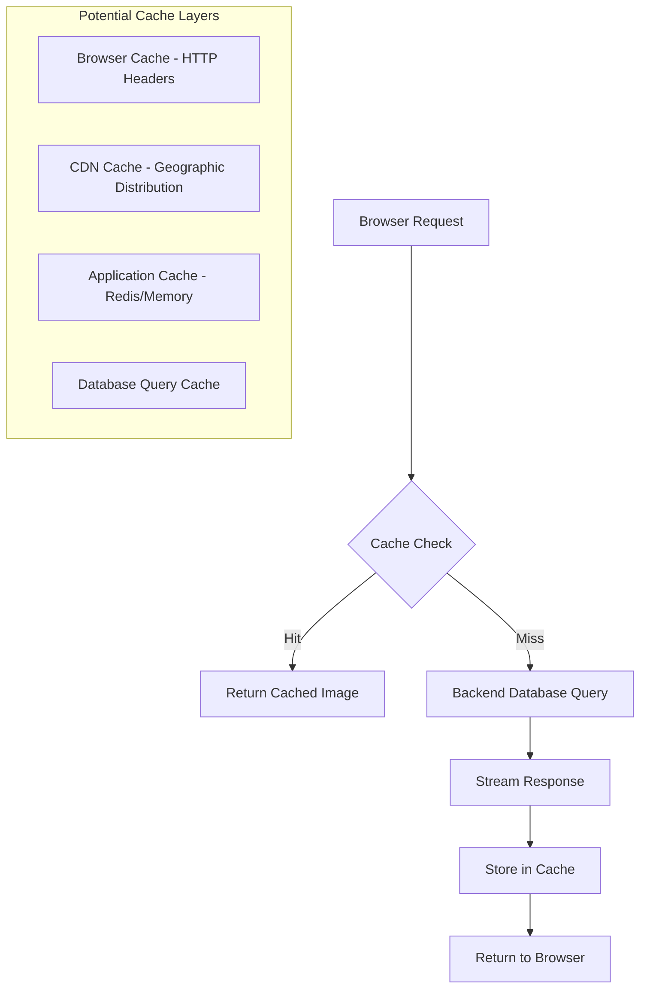
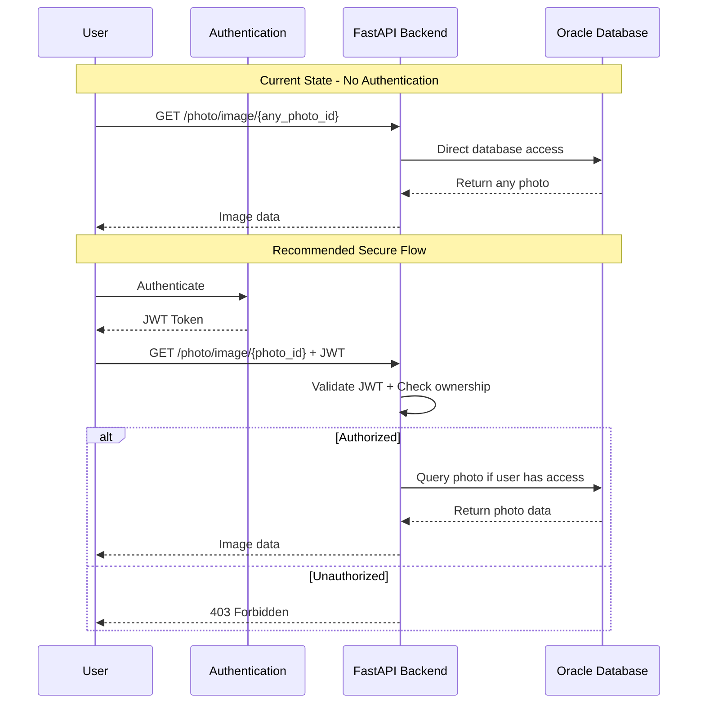
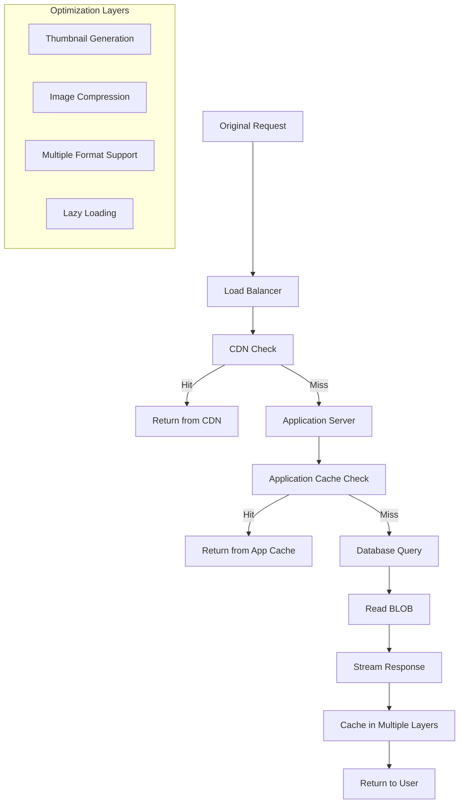

# Image Fetching Flow - Sequence Diagrams

This document provides detailed sequence diagrams for the image fetching flow in PhotoHub.

## Image Upload Flow



## Image Search and Display Flow



## Image Retrieval Detail Flow



## Error Handling Flow



## Component Interaction Overview



## Data Transformation Flow

```mermaid
graph LR
    subgraph "Backend Data Models"
        A[PhotoSearchResultItem] --> B[image_url: '/photo/image/{id}']
    end
    
    subgraph "Client Layer"
        C[PhotoSearchResultItemClientModel] --> D[image_url: '/photo/image/{id}']
    end
    
    subgraph "View Layer"
        E[PhotoSearchResultItemViewModel] --> F[imageUrl: 'http://api.url/photo/image/{id}']
    end
    
    A --> C
    C --> E
    
    G[environment.apiUrl] --> E
```

## Caching Opportunities



## Security Considerations Flow



## Performance Optimization Opportunities

